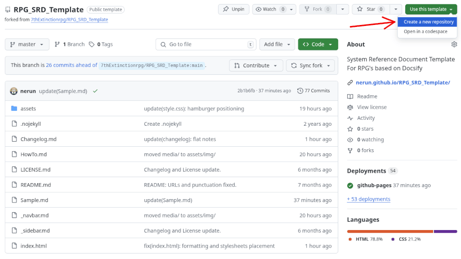
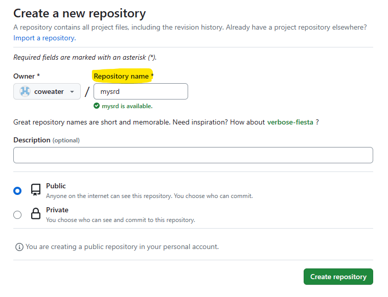
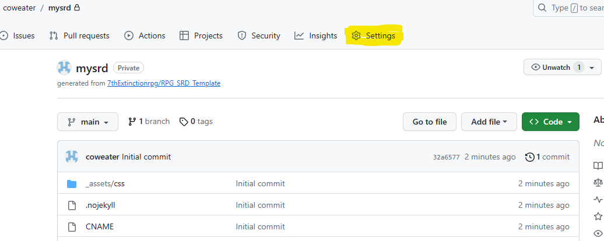
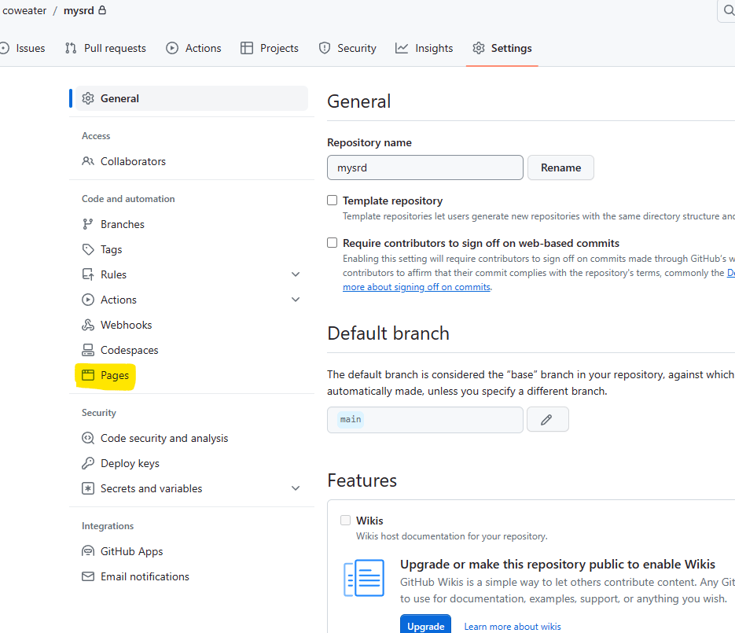
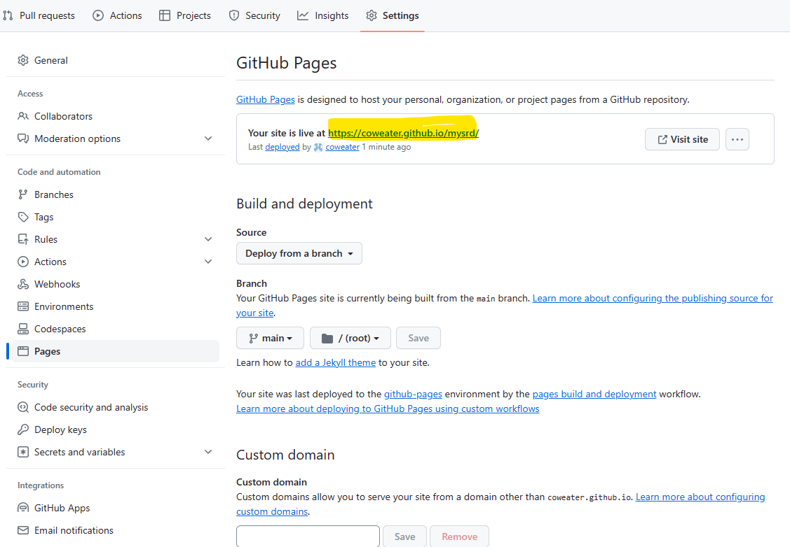

# Prerequisites

1. A basic understanding of the Markdown language:

   * CONE, Matt. [Basic Syntax](https://www.markdownguide.org/basic-syntax). *Markdown Guide*.
   * GitHub Docs. [Writing on GitHub](https://docs.github.com/en/get-started/writing-on-github).
   * PRITCHARD, Adam. [Markdown Cheatsheet](https://github.com/adam-p/markdown-here/wiki/Markdown-Cheatsheet). *github.com/adam-p/markdown-here*.

2. You will need to create a free [GitHub](https://github.com/) account if you don't have one. It’s recommended to use the name of your RPG, as this will become part of the URL people will use to access your SRD.

3. You can do this entire process through the browser without knowing Git. However, learning GitHub Desktop will allow you to test changes locally before deploying them live for the world to see.

---

# The Process

## Creating the Repository on GitHub

1. Log in to GitHub.

2. Navigate to the public template: [https://github.com/nerun/RPG\_SRD\_Template](https://github.com/nerun/RPG_SRD_Template)

3. Click **"Use this template"** and select **"Create a new repository"**.



4. Enter a repository name.



5. Select **"Private"**.

6. Click **"Create repository"**.

GitHub will take 5–30 seconds to copy the template. After that, you’ll have your own version.

7. Make sure the file **.nojekyll** exists. This is an empty file required when hosting a website on GitHub Pages; otherwise, the SRD may not display properly. *(It tells GitHub Pages not to process the site with Jekyll.)*

---

## Adding Your Content

### \*.md Files

`.md` files are Markdown files. Markdown is a lightweight markup language used to add formatting elements to plaintext text documents. Depending on the size of your content, you can either place all your game information in a single `.md` file or create separate files for each chapter. The `sample.md` file provides some formatting examples.

Markdown is easy to learn — refer to the links listed in point 1 under **Prerequisites** for a complete syntax guide.

### \_sidebar.md

This is your navigation menu on the left side of the website. After adding a Markdown file to your repository, you need to add it here so its contents are included. Follow the existing formatting.

### \_navbar.md

This is your top navigation bar. It works the same as `_sidebar.md` but allows for dropdown menus.

---

## Enabling GitHub Pages

To turn your repository into a website, follow these steps.

1. In your repository, click on **"Settings"**:



2. Select **"Pages"** from the left-hand menu:



3. If you haven't made the repository **public**, you have two choices:

   - Make the repository public, which allows you to use GitHub Pages to host your SRD website for free.
   - Upgrade your GitHub account (at the time of writing, it costs \$4/month or \$48 annually): Settings &rarr; Access &rarr; Billing and licensing &rarr; Licensing.

4. Under **"Branch"**, select `main` and click **"Save"**.

5. Wait 10–20 seconds, then refresh the page.

6. You’ll now see your website URL, e.g., `https://coweater.github.io/mysrd`:



---

## Changing Fonts

1. Edit the `/assets/css/style.css` file.

2. Under the `body` section, you’ll find the `siteFont` and `headingFont` variables.

3. Change these to the fonts you want to use.

---

## Using Wonderfull Icons

Remember that these icons are rendered on the website only. They are not part of the Markdown language. If you decide to distribute your Markdown documentation, the icons will not appear in any text reader. Only the icon name will.

### Font Awesome

Use Font Awesome to get free icons and animated icons. Subscribed users can use **"Pro"** icons.

1. Find a free icon on [Font Awesome](https://fontawesome.com/search?ic=free&o=r).

2. Select the icon.

3. In the popup window, under the **"HTML"** tab, copy everything between the quotes:

```html
<i class="fa-solid fa-dice-d20"></i>
```

4. Place the copied text between colons (`:text:`), with no spaces before or after:

`:​fa-solid fa-dice-d20​:` &rarr; :fa-solid fa-dice-d20:


### Material Icons

Use Material Icons for additional free icons:

1. Find a free icon on [Material Icons](https://fonts.google.com/icons?icon.set=Material+Icons).

2. Copy and insert the web span element directly into your Markdown files:

`<span class="material-icons">local_fire_department</span>` &rarr; <span class="material-icons">local_fire_department</span>

---

## LaTeX with MathJax syntax

If you need to use formulas, you can use [Scruel's docsify-latex plugin](https://scruel.github.io/docsify-latex) with MathJax syntax.

For inline math, use:

```markdown
This $e = mc^2$ is Einstein's formula.
```

For block (display) math:

```markdown
This is Einstein's formula:

$$
E = mc^2
$$
```

But remember to escape the dollar sign when not using formulas: `\$`.

You can replace the `$` and `$$` symbols with custom ones — see the [plugin documentation](https://scruel.github.io/docsify-latex/#/?id=options) for more details.

To disable $\LaTeX$ open `index.html` and comment or delete the two lines after `<!-- LaTeX & MathJax -->`.

Change:

```html
<!-- LaTeX & MathJax -->
<script src="//cdn.jsdelivr.net/npm/mathjax@3/es5/tex-mml-chtml.js"></script>
<script src="//cdn.jsdelivr.net/npm/docsify-latex@0"></script>
```

To:

```html
<!-- LaTeX & MathJax
<script src="//cdn.jsdelivr.net/npm/mathjax@3/es5/tex-mml-chtml.js"></script>
<script src="//cdn.jsdelivr.net/npm/docsify-latex@0"></script>
-->
```

## Adding Footnotes

Here's a simple footnote,[^1] and here's a longer one.[^bignote]

```markdown
Here's a simple footnote,[^1] and here's a longer one.[^bignote]


[^1]: This is the first footnote.

[^bignote]: Here's one with multiple paragraphs and code.

    Indent paragraphs to include them in the footnote.

    `{ my code }`

    Add as many paragraphs as you like.
```

---
[^1]: This is the first footnote.

[^bignote]: Here's one with multiple paragraphs and code.

    Indent paragraphs to include them in the footnote.

    `{ my code }`

    Add as many paragraphs as you like.